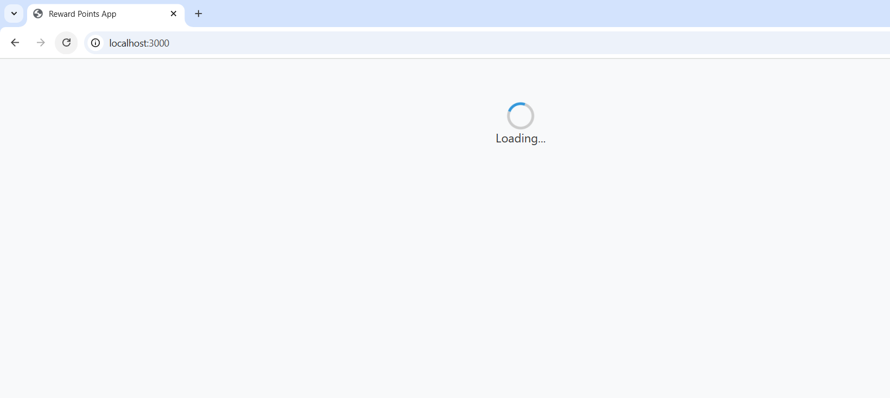

# Reward Points App
**Project Overview**
A React.js application that calculates customer reward points based on their transactions.
The reward points are calculated using the following criteria:

1. 1 point for every dollar spent between $50 - $100  and 
2. 2 points for every dollar spent over $100

* Fetches transactions from the local JSON
* Display Customer Dashboard with list of Customers
* Displays customer reward points per month and year
* Allows filtering transactions by customer & month
* Implements pagination for better UX
* Uses styled-components for UI styling
* Includes unit tests for calculations
* loader also added using spinner

**Features**
* Reward Points Calculation
* Monthly Filtering
* Styled Components
* API Simulation
* Unit Testing
* Pagination

Installation & Setup
1. Clone the Repository
2. Install dependency npm install
3. run the app using npm start
4. run the test case using npm test

Dashboard Screen

when filtering the customer name last 3 months default

Transaction when filtering months and year

Test case

