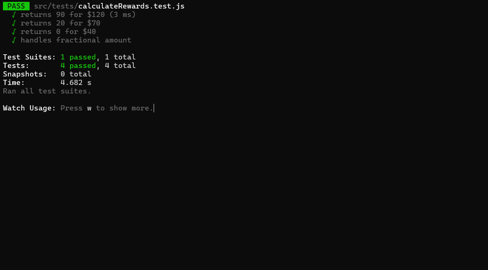

# Reward Points App
**Project Overview**
A React.js application that calculates customer reward points based on their transactions.
The reward points are calculated using the following criteria:

1. 1 point for every dollar spent between $50 - $100  and 
2. 2 points for every dollar spent over $100

* Fetches transactions from the local JSON
* Display Customer Dashboard with list of Customers
* Displays customer reward points per month and year
* Allows filtering transactions by customer & month
* Implements pagination for better UX
* Uses styled-components for UI styling
* Includes unit tests for calculations
* loader also added using spinner

**Features**
* Reward Points Calculation
* Monthly Filtering
* Styled Components
* API Simulation
* Unit Testing
* Pagination

Installation & Setup
1. Clone the Repository
2. Install dependency npm install
3. run the app using npm start
4. run the test case using npm test

Dashboard Screen

Transaction 

Test case

